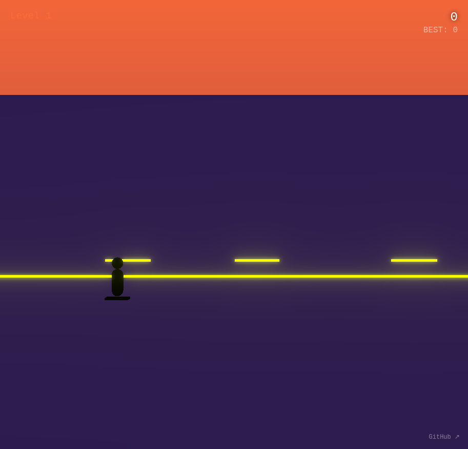

# Grind Chain

Tap to jump. Tap at peak to grind. Don't break the chain.

A side-scrolling skate grinding game where timing is everything. Chain grinds together for massive score multipliers, but one misstep and your chain breaks!

## How to Play

- **Tap once** to jump
- **Tap again at the peak** of your jump to lock a grind on any rail in range
- Each successful grind extends your combo chain
- The longer your chain, the higher your score multiplier
- Touch the ground without grinding to break your chain

## Features

- 5 progressively challenging levels
- Combo system with score multipliers
- Neon synthwave aesthetic
- Satisfying grind lock sounds
- Endless mode - beat your high score!

## Built With

- [Three.js r183](https://threejs.org/)
- [Tone.js v15.1.22](https://tonejs.github.io/)

## Links

- **Play:** https://nishivector.github.io/grind-chain/
- **Repo:** https://github.com/nishivector/grind-chain
